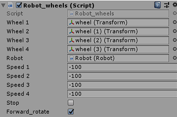
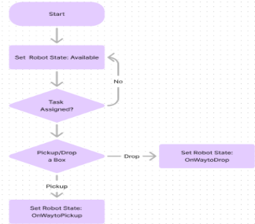

# Autonomous Warehouse Robot

## Introduction
- In this project, it aims to develop an efficient and autonomous warehouse management system using a swarm of robots. Each robot is designed to perform tasks such as moving and organizing inventory within a warehouse. To achieve this, it must be implemented using simulations such as Unity together with the programming language C#. 
## Project Overview
- Each robot in this system consists of a base equipped with wheels, allowing it to navigate the warehouse. Attached to the base is a structure with an arm designed to pick up packages and place them into a basket structure located near the arm. This enables the robot to carry multiple packages simultaneously. The robots are equipped with GPS sensors for precise location tracking, and remote Wi-Fi connections for task reception.This simulation ensures that each robot can perform fundamental operations accurately. 
- The Unity simulation consists of multiple robots working collaboratively to collect boxes from a warehouse and transport them to the unloading area. To efficiently collect the boxes, scripts have been implemented that allow the robots to be controlled as a swarm. This swarm control assigns the optimal robot to each task based on specific metrics and employs a training system that adjusts the weights in the assignment formula to achieve optimal results. Additionally, each robot is completely autonomous, with functions for calculating and following optimal routes.
- By using Unity and C#, it emphasizes the efficiency of task distribution within the swarm, ensuring that tasks are allocated dynamically among the robots to maximize overall efficiency.
## Importance of Skills and Concepts Learned
- Through this project, it can help to apply various skills and concepts, including robotic kinematics, and swarm intelligence. The use of Unity and C# help to create a scalable and efficient simulation environment. This project not only demonstrates the practical application of these skills but also highlights their importance in developing advanced autonomous systems for real-world scenarios. And lastly, this module enhances skills of students in unity and C# programming language.
  
## Features and Functionalities
### Coordinated robot swarm
- The system for assigning robots to collect boxes in a warehouse optimizes efficiency by using a formula to assign tasks based on minimal distance. The automatic training script enhances this system by iteratively adjusting the formula's weights to minimize the total collection time. When activated, this training mode adjusts the weights after processing a specific number of orders, continuously refining the process. The optimal values are stored in PlayerPrefs for persistent use, ensuring that the system improves over time, consistently reducing the overall order processing time and enhancing the operational efficiency of the warehouse.
### Nodes with a single direction of circulation
- The warehouse is mapped as a directed graph using a system summarized by four variables for each node: two integers and two booleans. The integers represent the set of nodes to which each node belongs and is connected, while the booleans indicate the positive or negative directions in the X and Z axes. This approach eliminates the need to explicitly save edges, allowing the algorithm to quickly determine node connections and permitted directions. As a result, edge generation is fully automated and scalable, and nodes maintain a single direction of circulation, preventing head-on collisions between robots. More details can be found in the Warehouse_node.cs script section.

- In addition, The warehouse node mapping system is designed for instant scalability and ease of modification. Each node is defined by four variables—two integers for node connections and two booleans for direction—which can be quickly adjusted from the Unity Inspector. Adding new nodes is simple, requiring only the modification of these variables without specifying each edge. This approach allows the warehouse to scale effortlessly, enabling robots to navigate new nodes seamlessly. The optimal route calculation script automatically considers new nodes, connections, and directions, eliminating the need for user code changes and ensuring a scalable and user-friendly design
### Autonomous robots
- Each robot in the warehouse has scripts to calculate and follow optimal routes between nodes, allowing them to navigate efficiently from any point to another. If a robot is outside the warehouse, such as when charging its battery, it automatically locates and moves to the nearest node. Robots are designed to operate independently, capable of functioning alone if necessary. The swarm script coordinates the robots by assigning tasks and locations, calling the robot's functions accordingly. When a robot is assigned to pick up an order, its status changes to OnWayToPick, preventing it from accepting other tasks until the current one is completed.

### Proximity sensors
- Simulated using triggers and box colliders, enabling robots to stop when they detect another robot in front of them. Robots also give priority to those detected on their right. Head-on collisions are prevented by the single-direction driving design of all nodes.

- Additionally, robots calculate the angle between their direction and the target location, rotating as needed to head directly toward the destination.

- For added realism, servomotors and wheels are simulated to rotate based on the robot's speed variable, ensuring that the wheels rotate faster as the robot moves faster.
  
### Scalable robot arm script
- A fully scalable robotic arm control script allows easy addition of joints and axes by editing game object settings in the Unity inspector. Each axis can be configured by adjusting its rotation axes, minimum and maximum angles, rotation speed, and associated Transform Object. Additionally, a simulated pneumatic actuator is included to pick up boxes and store them in the robot's basket.

- When robots reach their maximum box load capacity and are in the Available state, they automatically change to OnWayToDrop and head to the unloading zone. There, they smoothly unload the boxes onto a conveyor belt using a rotatable ramp, which then 
### Unloading boxes
- A fully scalable robotic arm control script allows easy addition of joints and axes by editing game object settings in the Unity inspector. Each axis can be configured by adjusting its rotation axes, minimum and maximum angles, rotation speed, and associated Transform Object.
- 
### Unloading zone
- When robots reach their maximum box load capacity and are in the Available state, they automatically change to OnWayToDrop and head to the unloading zone. There, they smoothly unload the boxes onto a conveyor belt using a rotatable ramp, which then transports the boxes to a large container.
### Software architecture of the simulation
- The robot control script manages all basic behaviors autonomously, allowing it to operate independently. It includes functions for moving to nodes and following paths, as well as automatically rotating towards target locations. The script incorporates features such as a GPS sensor for position detection, a configurable robotic arm for picking up boxes, and simulated proximity sensors for collision avoidance. State management ensures the robot transitions smoothly between tasks like picking up, delivering, and unloading boxes. The script is highly customizable via the Unity inspector, facilitating adjustments to movement speed, rotation speed, and maximum load capacity. Multiple robots can be seamlessly integrated into the system without modifying code, making scalability straightforward.
### Each robot in the system operates with a defined state that indicates its current task readiness and activity status
- NotReady:The robot is outside the warehouse and hasn't reached the closest node yet.
- Available: The robot is ready and can be assigned a task.
- OnWayToPick: En route to pick up an assigned order from a shelf location.
- PickingUp: At the shelf, actively using the robotic arm to pick up the order.
- OnWayToDrop: Heading towards the unloading area to deliver picked-up orders stored in its basket.
- PrepareUnloading: Positioned at the unloading area, rotating for optimal box unloading.
- RampGoingDown: Lowering the ramp to unload boxes into the cargo container.
- Unloading: Engaged in the process of unloading boxes.
- RampGoingUp: Elevating the ramp after completing box unloading.
- The robot begins in the NotReady state outside the warehouse, uses node locations to find the closest one, and rotates to face it. Upon reaching a node, it switches to Available. In this state, the Warehouse_orders.cs script assigns tasks like picking up boxes, transitioning the robot to OnWayToPick, then to PickingUp when at the box. If the container fills, it changes to OnWayToDrop, unloads boxes (PrepareUnloading, RampGoingDown, Unloading, RampGoingUp), then returns to Available. Customizable variables like speed and capacity are adjustable in Unity, and new robots can be added easily without code modification, detected automatically by scripts upon startup.

Warehouse.cs
- The script manages initialization of all nodes and robots in the scene, maintaining lists of both entities. It ensures robots are prepared after reaching their nearest node, ready to begin order collection. Using the setRobotRoute method, it assigns routes to robots, facilitating movement between nodes within the warehouse or starting from the robot's closest node.

### Warehouse_orders.cs
- warehouse_orders.cs manages task assignments for robots efficiently within the warehouse. It calculates metrics for available robots based on factors like distance to the order, number of orders processed, and robot capacity, with weights determined by
### Warehouse_training.cs. 
- The script selects the robot with the lowest metric to perform a task. Once chosen, Warehouse_orders.cs calls functions in Robot.cs to assign tasks and change statuses autonomously. Robots switch to OnWayToPick when assigned a task, ensuring they remain dedicated until completion. Additionally, the script offers a basic task assignment system as an alternative to the metric-based approach, although the latter is highly efficient for decision-making.
### Warehouse_shelf.cs
- Warehouse_shelf.cs manages shelf information and operations within the warehouse. It stores variables detailing product quantities and maximum capacity, generating new orders for processing by Warehouse_orders.cs. The script maintains a list of Warehouse_box.cs objects representing boxes on the shelf. Each shelf is associated with two Warehouse_node.cs scripts—one on the left and one on the right—providing robot nodes with coordinates for precise navigation to the shelf's location.

### Warehouse_node.cs
- Warehouse_node.cs facilitates automated edge generation and direction management within the warehouse graph. Variables like Edge1 and Edge2 define node connections along the Z-axis and X-axis respectively, enabling dynamic edge creation between nodes. Each node's directionX and directionZ variables dictate movement permissions along their respective axes, ensuring robots adhere to one-way traffic rules and preventing head-on collisions. This setup optimizes pathfinding and navigation efficiency without the need to store explicit edge data, enhancing scalability and flexibility. Node configurations, including directions and edge connections, can be easily adjusted via the Unity inspector, allowing rapid warehouse structure modifications. This scalable design supports seamless addition of new nodes by simply adding the prefab and configuring a few variables, maintaining smooth robot circulation and operational integrity.

### OptimalRoute.cs
- utilizes a recursive backtracking algorithm to calculate the optimal path between two warehouse nodes. It incorporates efficient branch pruning conditions to ensure fast computation of the optimal route.

### Robot_rightSensor.cs
- utilizes box colliders set as triggers to simulate a proximity sensor for detecting objects in front of and to the right of a robot. This script modifies the rightSensorCollision variable in the associated Robot.cs script to indicate collision status changes. Robot.cs then determines appropriate actions based on these collision detections, enabling collision avoidance behavior in the robotic system.

### NodesRow.cs
- manages rows within the warehouse by utilizing a RowID variable. This variable is utilized by Warehouse_node.cs objects within the same row to automate the generation of their Edge2 variable. This approach streamlines the edge generation process, ensuring efficient and accurate connectivity between nodes within the warehouse structure
### Robot_arm.cs
- Robot_arm.cs is a versatile script designed for managing robotic arm joints and their kinematics within a Unity environment. It supports scalability by allowing the addition of new joints directly from the Unity Inspector's game object settings, without requiring any code modifications. The script provides procedures for kinematic operations, enabling precise control over joint configurations, rotation axes, speed, and angle constraints. This flexible design facilitates easy customization and adjustment of robotic arm functionalities to suit specific project requirements.

### Warehouse_training.cs
- manages training mode functionality within the warehouse automation system. When enabled, the script automatically adjusts weights in the formula used to determine the most suitable robot for picking up orders. These adjustments occur after processing a specified number of orders, with weights modified based on the inverse of the processing time for those orders. This iterative process continues multiple times, aiming to identify optimal weights that minimize total order processing time. The script saves these optimal weights using PlayerPrefs, ensuring persistence across sessions for improved efficiency in task assignment and robot optimization.

### CameraControl.cs
- facilitates user-friendly navigation and viewing control within a simulation environment. Users can comfortably maneuver the camera using keyboard and mouse inputs
- Movement Controls: W (forward), A (left), D (right), S (backward), Space (up), LShift (down).
- Mouse Control: Allows rotation of the camera view.
- Toggle Speed Mode: Pressing V toggles between fast and slow camera movement speeds for precise navigation.
- Escape Key: Allows showing and hiding the mouse cursor for interaction with the Unity editor or simulation interface.
### Robot_actuator.cs
emulates the functionality of a pneumatic actuator within the Unity environment. It utilizes triggers and box colliders to simulate interactions with boxes, enabling the robot to effectively pick up and drop boxes as required. This script enhances realism by providing realistic actuator behavior, facilitating seamless integration of robotic operations within the warehouse simulation.
### Warehouse_box.cs
a straightforward script designed to manage the behavior of boxes within the warehouse simulation. It controls the effects of gravity on boxes and manages their position when they are interacted with by the pneumatic actuator. This script ensures that boxes behave realistically within the simulated environment, enhancing the overall fidelity of robotic operations and interactions with boxes in the warehouse setting.
### RobotWheel.cs
 a script responsible for simulating the movement of servo-motors and wheels within a robotic system in the Unity environment. It receives speed parameters from the associated robot script to control wheel movement. The script includes functionality to automatically stop servos and wheels when the robot is stationary, managed through a stop variable set by the robot script.
Robot.cs coordinates with Robot_wheels.cs to manipulate the stop variable, ensuring that wheel movement is locked during specific robot states such as PickingUp, RampGoingDown, Unloading, and RampGoingUp. This integration ensures realistic wheel behavior and enhances safety and operational control within the simulated warehouse environment.

### Warehouse Robot Diagram

### Warehouse Robot Flowchart

## Step by Step Guide 
  [View Project Documentation](https://docs.google.com/document/d/1z00WWJby2H_2fDr9AnieJ0wVluwxYejQ/editusp=sharing&ouid=101734205070446539416&rtpof=true&sd=true)

## Hands on Activities
  [View Project Documentation](https://docs.google.com/document/d/1QbCU5kkR3be_CvvwBwkss8JpcggZEdoY/edit?usp=sharing&ouid=101734205070446539416&rtpof=true&sd=true).

